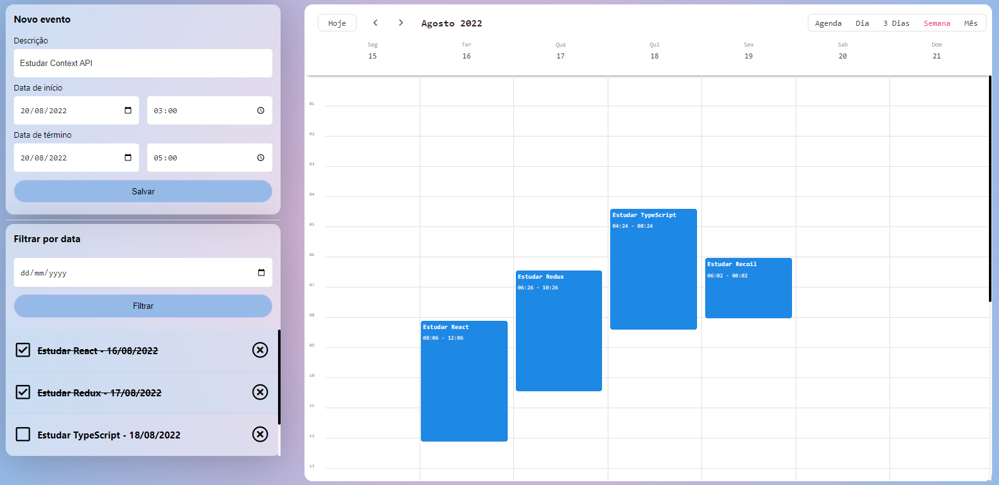

# Event Tracker

It's a calendar project which I have worked on to fix state and responsibilities problems.
I used Recoil to manage the state of the application.
I followed the principle of DRY encapsulating the recoil method, made customized hooks and created a simulation of an API with json-server.
#

## To run this project

In the project directory, you can run:

### `npm i`

### `npm start`

Install the dependencies then star the project on the localhost.\
Open [http://localhost:3000](http://localhost:3000) to view it in the browser.

Run that in a different port to simulate the REST API with json-server that has the default values to the events of the projects:

### `npx json-server --watch db.json`

#

## Screenshot

